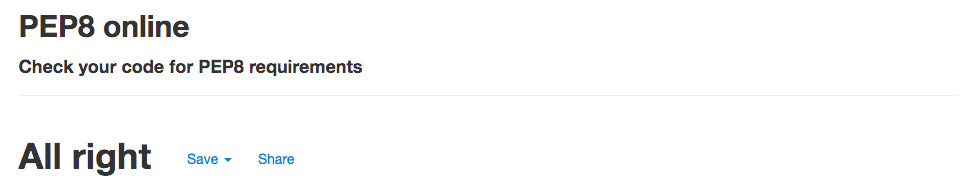

<h1>Bert's Art</h1>

[click here for the live site!](https://bertsart.herokuapp.com/)


my goal for this project is to create a full-stack site using HTML, CSS, JavaScript, Django and python to create a platform that artist can use  to share their work with a larger audience. At bert's Art we offer a large collection of different works you are able to purchase with a click of a button and have it shipped to you without having to leave your home! add more affordable wall art for your home to complete the look you want.

---

## Index 

- <a href="#ux">1. User experience (UX)</a>
  - <a href="#ux-stories">1.1 User stories</a>
  - <a href="#ux-wireframes">1.2 wireframes</a>
- <a href="#Data-Modelling">2.Data Modelling</a>
  - <a href="#features-existing">2.1 features</a>
  - <a href="#features-future">2.2 Features left to implement in the future</a>
- <a href="#technologies">3. Technologies used</a>
- <a href="#testing">4. Testing</a>
- <a href="#deployment">5. Deployment</a>
- <a href="#credits">6. Credits</a>


---

## USER EXPERIENCE

<span id="ux"></span>
The design for this site is simplistic to not overload the user, with the main focus being on finding the site to be easy to navigate for first time users who want to purchase some new, affordable art for themselves.

### USER STORIES
<span id="ux-stories"></span>

#### FIRST TIME VISITORS

* As a first time visitor, I want the site to be easy to understand how to navigate throughout the site.
* As a first time visitor, I want the content to be easily read and understandable.
* As a first time visitor, I want images to be clearly visible and enticing.
* As a first time visitor, I want to subscribe to a newsletter, so I can be up to date about the latest news and trends.
* As a first time visitor, I want to access the social media accounts of the company, so I can follow them and see the latest trends and news.
* As a first time visitor, I want to access the website from any device, so that I can go to the website on desktop, mobile and tablet.
* As a first time visitor, I want to be able to contact the owners of the website, so I can easily ask a question.
* As a first time visitor, I want to be able to search and filter the wall art.


#### RETURNING USER 1.1

* As a registered user, i want to be able to create/log into my profile.
* As a registered user, I want to add products to my basket, so I can buy products.
* As a registered user, I want to modify my order, so I can make last changes before I order the products.
* As a registered user, I want to be able to pay online securely. 
* As a registered user, I to receive a confirmation email and get an order number once placed so i know its been successful.
* As a registered user, I want to see my order history.
* As a registered user, I want to know the shipping details.
* As a registered user, I want to know the return policy.

#### Admin  1.12

* As an Admin i want to full control of the site, being able to edit, add delete the collection on site.


## WIREFRAMES 1.2
<span id="ux-wireframes"></span>


The wireframes can be found [here](wireframes.md).


### 2 Data Modelling/features
<span id="Data-Modelling"></span>
#### 1. Profile app 
#### UserProfile model

| **Name** | **Database Key** | **Field Type** | **Validation** |
--- | --- | --- | --- 
 User | user | OneToOneField |  User, on_delete=models.CASCADE
 Full Name | default_full_name | CharField | max_length=50, null=True, blank=True
 Phone number | default_phone_number | CharField | max_length=20, null=True, blank=True
 Country | profile_country | CountryField | blank_label='Country', null=True, blank=True
 Postcode | profile_postcode | CharField | max_length=20, null=True, blank=True
 Town/City | default_town_or_city | Charfield | max_length=40, null=True, blank=True
 Street address 1 | default_street_address1 | CharField | max_length=80, null=True, blank=True
 Street address 2 | default_street_address2 | CharField | max_length=80, null=True, blank=True

#### 2. Products app 
#### Category model

| **Name** | **Database Key** | **Field Type** | **Validation** |
--- | --- | --- | --- 
 name | name | CharField | max_length=254
 Friendly name | friendly_name | CharField | max_length=254, null=True, blank=True

 #### Product model

| **Name** | **Database Key** | **Field Type** | **Validation** |
--- | --- | --- | --- 
 Category| category| ForeignKey | Category, null=True, blank=True, on_delete=models.SET_NULL
 Sku number | sku | CharField | max_length=40, null=True, blank=True
 Name| name | CharField | max_length=250
 Description| description | TextField | null=True, blank=True
 Price | price | DecimalField | max_digits=5, decimal_places=2, null=False, default=0
 Image | image | ImageField | null=True, blank=True
 Image url | image_url | URLField | max_length=1024, null=True, blank=True
 In stock | in_stock | BooleanField | default=True

#### 3. Checkout app 
#### Order model

| **Name** | **Database Key** | **Field Type** | **Validation** |
--- | --- | --- | --- 
 Order number | order_number | CharField | max_length=32, null=False, editable=False
 User profile | user_profile | ForeignKey | UserProfile, on_delete=models.SET_NULL, null=True, blank=True, related_name='orders'
 Full name | full_name | CharField | max_length=50, null=False, blank=False
 Email| email| EmailField | max_length=254, null=False, blank=False
 Phone number | phone_number | Charfield | max_length=20, null=True, blank=True
 Country| country | CountryField | blank_label='Country *', null=False, blank=False
 Postcode | postcode| CharField | max_length=20, null=True, blank=True
 Town/City | town_or_city | CharField | max_length=40, null=True, blank=True
 Street address 1 | street_address1 | CharField | max_length=80, null=True, blank=True
 Street address 2 | street_address2 | CharField | max_length=80, null=True, blank=True
 Date | date | DateTimeField | auto_now_add=True
 Delivery cost | delivery_cost | DecimalField | max_digits=6, decimal_places=2, null=False, default=0
 Order total | order_total | DecimalField | max_digits=10, decimal_places=2, null=False, default=0
 Grand total | frand_total | DecimalField | max_digits=10, decimal_places=2, null=False, default=0
 Original bag | original_bag | TextField | null=False, blank=False, default=''
 Stipe pid | stripe_pid | CharField | max_length=254, null=False, blank=False, default=''

 #### OrderLineItem model

| **Name** | **Database Key** | **Field Type** | **Validation** |
--- | --- | --- | --- 
 Order  | order | ForeignKey | Order, null=False, blank=False, on_delete=models.CASCADE, related_name='lineitems'
 Product | product | ForeignKey | Product, null=False, blank=False, on_delete=models.CASCADE
 Quantity | quantity | IntegerField | null=False, blank=False
 Lineitem total | lineitem_total | DecimalField | max_digits=6, decimal_places=2, null=False, blank=False, editable=False

#### 4. Contact app 
#### ContactMessage model

| **Name** | **Database Key** | **Field Type** | **Validation** |
--- | --- | --- | --- 
 Full name | full_name | CharField | max_length=50
 Email| email| EmailField | 
 Message | message| TextField | 

#### 5. Newsletter app 
#### Subscribe model

| **Name** | **Database Key** | **Field Type** | **Validation** |
--- | --- | --- | --- 
 Email | email| EmailField | max_length=255
 Date | date | DateTimeField | auto_now_add=True


 
<span id="features"></span>

<h1>2. Features</h1>

<span id="features-existing"></span>

### 2.1 Existing features 


####  Home page
- serves its purpose as an introduction to the site/shop via text and pictures.
- links to other features of the site all easy to find and accessible.
- An attractive and simple layout with consistency.

####  footer 
- found at the bottom of all pages 
- with links to our pages app, which have the following pages Contact, About us, FAQ and our returns policy.
- a link to our newsletter which the user is encouraged to subscribe to.
- links to all our socials.

####  Navbar
- The name of the site is clearly visible on the left of the navbar. The name is also a redirect to the home page. 
- The navbar contains search functionality allowing the user to search for products easily.
- on mobile devices the navbar is visible as a hamburger menu.
- the navbar contains the profile icon and the shopping bag, where you can login or register and reflects the items you have put into your shopping basket respectively. 

####  Navbar
- The name of the site is clearly visible on the left of the navbar. The name is also a redirect to the home page. 
- The navbar contains search functionality allowing the user to search for products easily.
- on mobile devices the navbar is visible as a hamburger menu.
- the navbar contains the profile icon and the shopping bag, where you can login or register and reflects the items you have put into your shopping basket respectively.

#### Product page 
- The product page contains all items the shop has to offer.
- The items can be sorted by name A-Z, Z-A, price from high to low and price from low to high.
- There is a back to top button, where people can click on the link to go back to the top of the page. 

#### Product detail page 
- The product detail page shows information about that specific item, the information includes; name, image, the price and the product description. 
- A user can select the quantity of the product. this ranges from 1 being the lowest to 99 being the highest. 
- There is a button where the user can add to shopping bag, which when used will show a toast success message and will update the shopping bag.

#### bag page 
-  the bag pages shows the user all the items in their bag at the moment, with the price of the item and quanity that they have selected.
- calculates the total price of all the items in the bag for the user and how much more to spend to be entitled to free delivery.
- 2 links at the bottom which redirect you to continue shopping or to the checkouts page.

#### Checkout page 
- The order summary gives information about the item, this information includes; name, price, total, delivery costs and grand total. 
- a form to complete for shipping details, that once completed for a registed user will save their information.
- Two buttons at the bottom to complete the order or to adjust it which would take you back to the bag page.
- when completing the order you will get a toast success message showing you have your order has been successful.
- you will be taken to the checkout success page when completeing your order.

#### Checkout succes page
- contains the order information along with your order number
- button at the bottom to take you back to the products page to continue shopping if you would like.

#### pages CONTACT/ABOUT-US/FAQ/RETURNS
- users can use the contact page to reach out to the site owner, with a simple form to fill out.
- about-us page contains a little information about the site owner and the team.
- FAQ contains answers to some common questions the users might have as well as a link to the returns page at the bottom.
- the returns page contains our returns policy.

#### Allauth features
- sign up, login, logout, reset passwords for users are all done using allauth.


<span id="features-future"></span>

### 2.2 Features left to implement in the future 
- Add a review page where users can leave comments on items they have purchased.
- Adding a favorite section to the users profile so that users can favorite a piece and see them on their favorite page.  
- The user can delete their profile.
- logging in with social media accounts.

<span id="technologies"></span>

<h1>3. Technologies used</h1>

#### Languages used
- [HTML5](https://en.wikipedia.org/wiki/HTML5)
    - HTML5 provides the structure and the content for my project. 
- [CSS3](https://en.wikipedia.org/wiki/Cascading_Style_Sheets)
    - CSS3 provides the style of the HTML5 elements.
- [jQuery](https://jquery.com/)
    - jQuery used as the JavaScript functionality.
- [Python](https://www.python.org/)
    - Python provides the backend of the project.
- [Jinja](https://en.wikipedia.org/wiki/Jinja_(template_engine))
    - Jinja provides the templating language for Python.
- [JavaScript](https://nl.wikipedia.org/wiki/JavaScript)
    - JavaScript provides the interactive elements on the website. 

#### Frameworks, libraries & Other
- [Gitpod](https://www.gitpod.io/) 
    - The GitPod is used to develop the project.
- [Git](https://git-scm.com/)
    - The Git was used for version control to commit to Git and push to GitHub.
- [GitHub](https://github.com/)
    - The GitHub is used to host the project.
- [Google Fonts](https://fonts.google.com/)
    - Google Fonts is used to provide the font roboto for all the text that is used in the project. 
- [Heroku](https://dashboard.heroku.com/)
    - Heroki is the cloud platform to deploying the app.
- [Flask](https://flask.palletsprojects.com/en/1.1.x/)
    - Flask is the web framework used to provide libraries, tools and technologies for the app.
- [AWS Amazon](https://aws.amazon.com/)
    - AWS Amazon is used to store static and media files.
- [Boto3](https://boto3.amazonaws.com/v1/documentation/api/latest/index.html)
    - Boto3 is used for compatibility in AWS.
- [Gunicorn](https://pypi.org/project/gunicorn/)
    - Gunicorn is used to enable deployment to Heroku.
- [Bootstrap](https://getbootstrap.com/)
    - Bootstrap is used for the design framework.
- [Django](https://www.djangoproject.com/) 
    - The GitPod is used as Python framework for the project.
- [Django Crispy Forms ](https://django-crispy-forms.readthedocs.io/en/latest/)
    - Django Crispy Forms is used to style the Django forms
- [Stripe](https://stripe.com/en-nl)
    - Stripe is used for the secure payments 

#### Databases 
- [SQlite3](https://www.sqlite.org/index.html)
    - SQlite3 is used as the development database.
- [PostgreSQL](https://www.postgresql.org/)
    - PostgreSQL is used as the production database.


<span id="testing"></span>

<h1>4. Testing</h1>


#### Testing tools used 4
- [PEP8](http://pep8online.com/)
    - The PEP8 validator is used to check whether there were any errors in the Python code.
- [Chrome DevTools](https://developers.google.com/web/tools/chrome-devtools/open) is used to detect problems and test responsiveness.
- [W3C Markup Validation Service](https://validator.w3.org/)
    - The W3C Markup Validation Service is used to check whether there were any errors in the HTML5 code. 
- [W3C CSS validator](https://jigsaw.w3.org/css-validator/)
    - The W3C CSS validator is used to check whether there were any errors in the CSS3 code.
- [JShint](https://jshint.com/)
    - JShint is a JavaScript validator that is used to check whether there were any errors in the JavaScript code. 

#### Manual testing

## Browser compatibility 4.1
- Responsiveness on different browsers and screen sizes:

[Google Chrome](https://google.com) works as intended.<br>
[Mozilla Firefox](https://www.mozilla.org/en-GB/firefox/new/) works as inteaded.<br>
[Internet Explorer](https://www.microsoft.com/en-gb/download/internet-explorer.aspx) works as intended.<br>
[Opera](https://www.opera.com/) works as intended.<br>

manuel tested each one to ensure the website was responsive on the different browers listed via testing them all on different resoultions.

#### Validators 4.2

- **[Python validator | PEP8](http://pep8online.com/):** No errors found


- **[HTML Validator](https://validator.w3.org/):** No major errors to show.

- **[CSS Validator](https://jigsaw.w3.org/css-validator/):** No errors found.


#### user stories 4.3

#### FIRST TIME VISITORS 

* As a first time visitor, I want the site to be easy to understand how to navigate throughout the site.
  - A visitor can navigate throug the website with the navbar on top of the website and through the footer. There is a hamburger menu for mobile visitors, where they can easily can go to every relevant page.

* As a first time visitor, I want the content to be easily read and understandable.
    -the site is clear and minimal nothing distracting for first time users.

* As a first time visitor, I want images to be clearly visible and enticing.
    - a first time visitor willfind thats the pictures dont overload the page and make for eye pleaseing viewing.

* As a first time visitor, I want to subscribe to a newsletter, so I can be up to date about the latest news and trends.
    - the subscibe to newsletter button is found at the bottom of every page in the footer which navigates you easily to the page.

* As a first time visitor, I want to access the social media accounts of the company, so I can follow them and see the latest trends and news.
    - the social media accounts can all be found in the footer on every page

* As a first time visitor, I want to access the website from any device, so that I can go to the website on desktop, mobile and tablet.
    - you can visit the website on any device. The website is designed for computer, mobile and tablet.

* As a first time visitor, I want to be able to contact the owners of the website, so I can easily ask a question.
    - a link to The contact page can easily be found in the footer on every page which will navigate you to the mentioned page.

* As a first time visitor, I want to be able to search and filter the wall art.
    - using the search bar you can filter the works based on their name and whats in their description.

* As a first time visitor, I want to add products to my basket, so I can buy products.
    - when selecting a product and being directed to the products detail page you will find the option to add to basket.

#### RETURNING USER 

* As a registered user, i want to be able to create/log into my profile.
    - on the navbar under the under the "My account" drop down button the user has the option to register to the site.

* As a registered user, I want to modify my order, so I can make last changes before I order the products.
    - this can be accomplished by going to the bag page

* As a registered user, I want to be able to pay online securely. 
    - using stripe on the checkout page this is accomplished 

* As a registered user, I to receive a confirmation email and get an order number once placed so i know its been successful.
    - once you have submitted an order you will recieve both.

* As a registered user, I want to see my order history.
    - on your profile page you will have a your order history on the right hand side which you can click on for more details.

* As a registered user, I want to know the shipping details.
    - This can be found on the FAQ page.

* As a registered user, I want to know the return policy.
    - this can be found on the returns page.

#### Admin  

* As an Admin i want to full control of the site, being able to edit, add delete the collection on site.


## Responsiveness 4.5

- Responsiveness of the game is tested with [Chrome DevTools]


##  Bugs 4.6

- since the website is very simplistic havent found major bugs other than had some issues with using bootstrap css as certain elements werent interacting well or at all together.
    - i was using two different versions of bootstrap and simply had to swap to one.

## Future testing 4.7

due to time constraints testing thoroughly wasnt an option on this project, however since a large part of this has been taken from the code along project boutique ado it hasnt hampered the project. in future i would like to do alot more testing with the views and models.

<span id="deployment"></span>

<h1>5. Deployment</h1>

# Deployment
## Heroku Deployment with AWS
This website is deployed on [Heroku](https://www.heroku.com/), following these steps:
1. Install these packages to your local environment, since these packages are required to deploy a Django project on Heroku.
- [gnicorn](https://gunicorn.org/): `gnicorn` is Python WSGI(web server gataway interface) server for UNIX.
- [gninx](https://www.nginx.com/): `gninx` is a free, open-source, high-performance HTTP server and reverse proxy, as well as an IMAP/POP3 proxy server.
- [psycopg2-binary](https://pypi.org/project/psycopg2-binary/): `psycopg2-binary` is PostgreSQL database adapter for the Python programming language.
- [dj-database-url](https://pypi.org/project/dj-database-url/): `dj-database-url` allows you to utilize the 12factor inspired DATABASE_URL environment variable to configure your Django application.
2. Create a `requirements.txt` file and freeze all the modules with the command `pip3 freeze > requirements.txt` in the terminal.
3. Create a `Procfile` write `web: gunicorn bubbles.wsgi:application` in the file.
4. `git add` and `git commit` and `git push` all the changes to the Github repositoty of this project.
5. Go to Heroku and create a **new app**. Set a name for this app and select the closest region (Europe) and click **Create app**.
6. Go to **Resources** tab in Heroku, then in the **Add-ons** search bar look for **Heorku Postgres**(you can type postgres), select **Hobby Dev — Free** and click **Submit Order Form** button to add it to your project.
7. In the heroku dashboard for the application, click on **Setting** > **Reveal Config Vars** and set the values as follows:

| Key | Value |
| ----------- | ----------- |
| AWS_ACCESS_KEY_ID | `Your AWS Access Key` |
| AWS_SECRET_ACCESS_KEY | `Your AWS Secret Access Key` |
| DATABASE_URL | `Your Postgres Database URL` |
| EMAIL_HOST_PASS | `Your Email Password (generated by Gmail)` |
| EMAIL_HOST_USER | `Your Email Address` |
| SECRET_KEY | `Your Secret Key` |
| STRIPE_PUBLIC_KEY | `Your Stripe Public Key` |
| STRIPE_SECRET_KEY | `Your Stripe Secret Key` | 
| STRIPE_WH_SECRET | `Your Stripe WH Key` |
| USE_AWS | `True` |

* I used [Djecrety](https://djecrety.ir/) to generate Django Secret Key.

8. Comment out the current database setting in settings.py, and add the code below instead. This is done temporarily to migrate the datbase on Heroku.
```
  DATABASES = {     
        'default': dj_database_url.parse("<your Postrgres database URL here>")     
    }
```
9. Migrate the database models to the Postgres database using the following commands in the terminal:
`python3 manage.py migrate`
10. Load the data fixtures(products and categories) into the Postgres database using the following command:
`python3 manage.py loaddata <fixture_name>`
11. Create a superuser for the Postgres database by running the following command:
`python3 manage.py createsuperuser`
12. Replace the database setting with the code below, so that the right database is used depending on development/deployed environment.
```
if 'DATABASE_URL' in os.environ:
    DATABASES = {
        'default': dj_database_url.parse(os.environ.get('DATABASE_URL'))
    }
else:
    DATABASES = {
        'default': {
            'ENGINE': 'django.db.backends.sqlite3',
            'NAME': os.path.join(BASE_DIR, 'db.sqlite3'),
        }
    }
```
13. Disable collect static, so that Heroku won't try to collect static file with: `heroku config:set DISABLE_COLLECTSTATIC=1`
14. Add `'https://bertsart.herokuapp.com/', 'localhost' `to ALLOWED_HOSTS` in settings.py.
```
ALLOWED_HOSTS = ['https://bertsart.herokuapp.com/', 'localhost',]
```
15. In Stripe, add Heroku app URL a new webhook endpoint.
16. Update the settings.py with the new Stripe environment variables and email settings.
17. Commit all the changes to Heroku. Medial files are not connected to the app yet but the app should be working on Heroku.

### Amazon Web Service S3
The static files and media files for this deployed site (e.g. image files for product/blog) are hosted in the [AWS](https://aws.amazon.com/) S3 Bucket. You will need to create S3 bucket, complete the setting up and upload static files and media files to the S3 bucket. You can find [Amazon S3 documentation](https://docs.aws.amazon.com/AmazonS3/latest/gsg/CreatingABucket.html) for more information on the setting.
I used CORS configuration below:
```
[
  {
      "AllowedHeaders": [
          "Authorization"
      ],
      "AllowedMethods": [
          "GET"
      ],
      "AllowedOrigins": [
          "*"
      ],
      "ExposeHeaders": []
  }
]
```

- Setting for static/media files in settings.py
1. Install `boto3` and `django-storages` with a command `pip3 install boto3` and `pip3 install django-storages` in your terminal, to connect AWS S3 bucket to Django.
2. Add 'storages' to `INSTALLED_APPS` in settings.py.
3. Add the following in settings.py.
```
if 'USE_AWS' in os.environ:
    # Cache Control
    AWS_S3_OBJECT_PARAMETERS = {
        'Expires': 'Thu, 31 Dec 2099 20:00:00 GMT',
        'CacheControl': 'max-age=94608000',
    }

    # Bucket Config
    AWS_STORAGE_BUCKET_NAME = 'ms4-bubbles'
    AWS_S3_REGION_NAME = 'eu-central-1'
    AWS_ACCESS_KEY_ID = os.getenv('AWS_ACCESS_KEY_ID')
    AWS_SECRET_ACCESS_KEY = os.getenv('AWS_SECRET_ACCESS_KEY')
    AWS_S3_CUSTOM_DOMAIN = f'{AWS_STORAGE_BUCKET_NAME}.s3-eu-central-1.amazonaws.com'

    # Static and media files
    STATICFILES_STORAGE = 'custom_storages.StaticStorage'
    STATICFILES_LOCATION = 'static'
    DEFAULT_FILE_STORAGE = 'custom_storages.MediaStorage'
    MEDIAFILES_LOCATION = 'media'

    # Override static and media URLs in production
    STATIC_URL = f'https://{AWS_S3_CUSTOM_DOMAIN}/{STATICFILES_LOCATION}/'
    MEDIA_URL = f'https://{AWS_S3_CUSTOM_DOMAIN}/{MEDIAFILES_LOCATION}/'
```
5. Add [custom_storages.py].
6. Delete DISABLE_COLLECTSTATIC from Heroku Config Var.
7. Push all the changes to Github/Heroku and all the static files will be uploaded to S3 bucket.
By setting up above, Heroku will run python3 manage.py collectstatic during the build process and look for static and media files.

### Automatic Deploy on Heroku
You can enable automatic deploy in the following steps that pushes update to Heroku everytime you push to github.
1. Go to Deploy in Heroku dashboard.
2. At `Automatic deploys`, choose a github repository you want to deploy.
3. Click `Enable Automatic Deploys`.


## How to Clone 
1. Navigate to the GitHub Repository.
2. Click the Code drop down menu.
3. Either Download the ZIP file, unpackage locally and open with IDE (This route ends here) OR Copy Git URL from the HTTPS dialogue box.
4. Open your developement editor of choice and open a terminal window in a directory of your choice.
5. Use the git clone command in terminal followed by the copied git URL.
6. A clone of the project will be created locally on your machine.

Once the project has been loaded into an IDE of choice, run the following command in the shell to install all the required packages: pip install -r requirements.txt.

### **How to Fork the respository**

1. Log into GitHub.
2. In Github go to (https://github.com/MichaelDugdale/MS4_berties_art).
3. In the top right hand corner click "Fork".


<span id="credits">
<h1>8. Acknowledge</h1>

Thanks to the following people and organizations who helped or inspired me for the project:  
-   inspiration for the site was from (https://www.singulart.com/en/?campaign_id=203&keyword=buy%20art%20online&matchtype=e&gclid=CjwKCAjwrfCRBhAXEiwAnkmKmTVeoNxBtWoqGcDKBUhPt4yiipHzgIIdkHC2w19Zdhwi835LyQ-XxRoCMXcQAvD_BwE)
- The support and guidance of my mentor Precious Ijege. 
- The lessons and knowledge of [Code Institute.](https://codeinstitute.net/)
- The advice about bugs from the Tutor Assistance of Code Institute.

## Resources 

-   media 
        - all images were taken from kaggle (https://www.kaggle.com/bryanb/abstract-art-gallery)
- [Code Institute Course Content](https://courses.codeinstitute.net/) - Code fundamental learning platform
- [Stack Overflow](https://stackoverflow.com/)
- [W3Schools](https://www.w3schools.com/)
- [Django Documentation](https://www.djangoproject.com/)


1. User experience (UX)

1.1 Project goals
Making a full-stack site based around business logic used to control a centrally-owned database.
The site provides an authentication mechanism and provides paid access to the site’s data based on the dataset.
Making a full-stack site that uses HTML, CSS, JavaScript, Python + Django.
Creating a website that uses a relational database
Creating a website that uses Stripe payments
Creating a website that serves as a webshop to sell prints with different types of art.

1.2 Business goals
Creating a secure and professional e-commerce website.
Provide users inspiration for different art and designs.
Makes profit with selling prints.
Makes art accessible to everyone.

1.3 Visitor goals
Get inspired for wall art in the office or at home.
Safely purchase art on the webshop.

1.4 Target audience
Everyone who loves art.
People who want to be inspired for wall art.
People who are looking for wall art to decorate their home, office, etc.

1.5 User stories
Visitor goals:

As a visitor, I want to access the website from any device, so that I can go to the website on desktop, mobile and tablet.
As a visitor, I want to be able to navigate easily through the website, so I can find everything easily.
As a visitor, I want to access the social media accounts of the company, so I can follow them and see the latest trends and news.
As a visitor, I want to sign up for the newsletter, so I can be up to date about the latest news and trends.
As a visitor, I want to know more about the company, so I know what the company is about.
As a visitor, I want to be able to contact the owners of the website, so I can easily ask a question.
As a visitor, I want to see an overview of all the wall art, so I can see what the website is offering.
As a visitor, I want to be able to search and filter the wall art, so I can find specific wall art quick and easy.
As a visitor, I want to be able to read more information about the wall art (size, price, image, description), so I can see if the product suits my preferences.
Consumer goals:

As a consumer, I want to add products to my basket, so I can buy products.
As a consumer, I want to modify my order, so I can make last changes before I order the products.
As a consumer, I want to be able to delete products in my order, so I can remove products that I no longer wish to purchase.
As a consumer, I want to see the total price and shipping costs of my order, so I can see how much I have spent in total.
As a consumer, I want to pay with a card in a safe and secure way, so I know that my payment goes well.
As a consumer, I want to receive a confirmation email of the order, so I know that the order is successfully received.
As a consumer, I want to create an account, so I can see my profile details and order history.
As a consumer, I want to know more about shipping, delivery, etc., so I know more about when and how my package arrives.
As a consumer, I want to know how I can return my package, so I know how I can return my packages if I want to.
Returning consumer goals:

As a returning consumer, I want to login and logout at my account anytime, so I can make an order quickly and so I can see my order history.
As a returning consumer, I want to reset/change my password (if I forgot it), so I can get access to my profile.
As a returning consumer, I want to be able to change my email, so I can have access to the profile with another email address.
Admin goals:

As admin, I want to add, modify and delete products, so I manage the assortment of all products on the website.